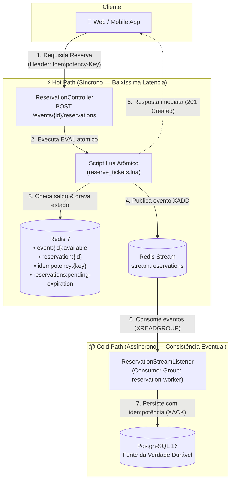
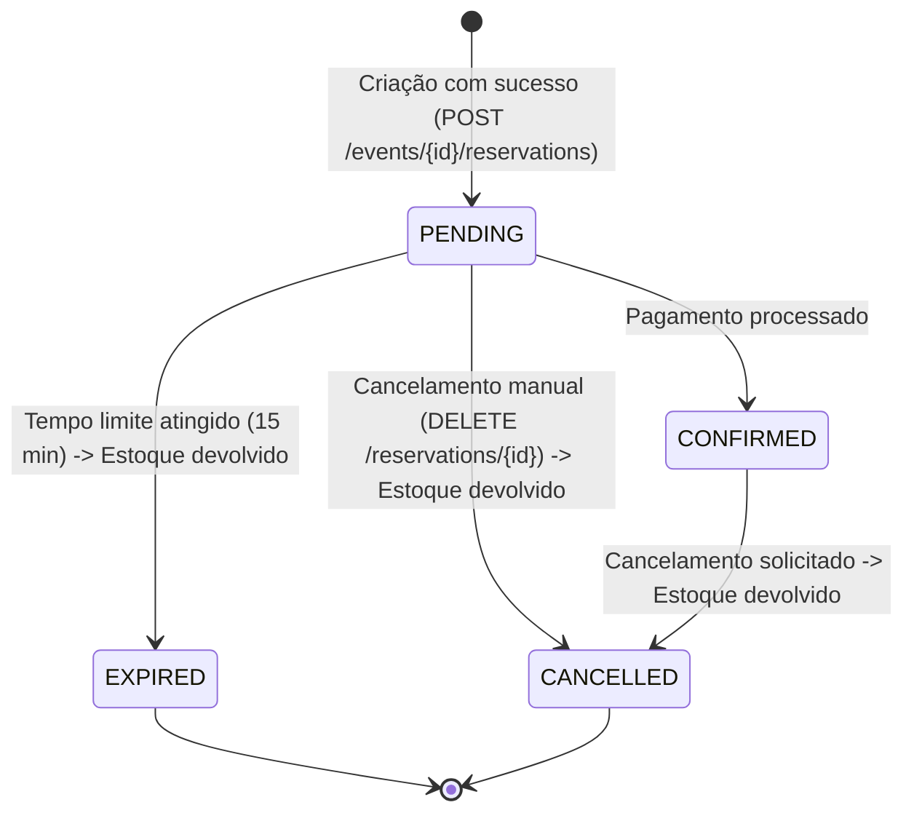

# ⚡ Flash Booking

> **Engine de alta performance para reserva de ingressos em vendas relâmpago (*flash sales*), com garantia estrita de zero *overbooking*, baixíssima latência e persistência assíncrona.**


---

## 🎯 O Desafio & A Solução

Em vendas de ingressos de alta demanda (como shows de grande porte ou finais de campeonato), dezenas de milhares de clientes tentam reservar os mesmos ingressos no exato mesmo segundo.

As abordagens tradicionais sofrem com dois gargalos críticos:
1. **Overbooking por Condição de Corrida:** Leituras e escritas concorrentes não atômicas permitem vender mais ingressos do que a capacidade real do evento.
2. **Gargalo no Banco Relacional:** Travas em linhas de tabela (`SELECT ... FOR UPDATE`) sob concorrência massiva esgotam os pools de conexão, disparam a latência e derrubam o serviço.

### Como o Flash Booking resolve isso?
O **Flash Booking** divide o ciclo de vida da requisição em dois caminhos complementares:
- **Hot Path (Ultra-rápido & Em Memória):** Toda decisão de reserva, validação de saldo e controle de idempotência ocorre no **Redis** via **scripts Lua atômicos**. O cliente recebe a confirmação em milissegundos, sem tocar no banco relacional durante o caminho crítico.
- **Cold Path (Durabilidade & Consistência Eventual):** O resultado da operação é publicado em um **Redis Stream** e processado de forma assíncrona por *workers*, que garantem a persistência no **PostgreSQL** para histórico e auditoria.

---

## 🏗️ Arquitetura do Sistema



---

## 💎 Principais Destaques de Engenharia

- ⚡ **Zero Locks Distribuídos:** A atomicidade nativa *single-threaded* do Redis aliada a scripts Lua elimina a necessidade de locks complexos (como Redlock) ou travas pessimistas no banco relacional.
- 🛡️ **Idempotência em Duas Camadas:**
  - *Camada de Cache:* Validação instantânea no Redis com TTL configurável, retornando `200 OK` para requisições repetidas sem reprocessar saldo.
  - *Camada de Persistência:* `UNIQUE constraint` na chave de idempotência no PostgreSQL, blindando o banco contra reprocessamentos indesejados.
- ⏳ **Expiração Automática sem Polling Ineficiente:**
  - Reservas pendentes entram em um `Sorted Set` (`ZSET`) ordenado pelo timestamp de expiração.
  - Uma rotina periódica executa um script atômico (`expire_reservations.lua`) que estorna o estoque e cancela reservas vencidas em lotes.
- 🔄 **Cache-Aside / Read-Through Resiliente:** Consultas `GET /reservations/{id}` e `GET /events/{id}` leem primeiro do Redis (cobrindo o período de consistência eventual) e possuem *fallback* automático com recarga (*repopulate*) a partir do PostgreSQL.
- 🛰️ **Resiliência Multi-Instância:**
  - Identidade exclusiva de consumidores (`host + UUID`) dentro do *consumer group*.
  - Tarefa de auto-recuperação (`ReservationStreamRecoveryTask`) com `XCLAIM` para resgatar mensagens travadas por instâncias que falharam.
  - Mecanismo de re-tentativa e contenção de mensagens envenenadas (*poison pills*).

---

## 🗄️ Estruturas de Dados no Redis

| Chave / Estrutura | Tipo | Finalidade |
|---|---|---|
| `event:{eventId}:available` | `String (Integer)` | Contador em tempo real do saldo de ingressos disponíveis. |
| `reservation:{reservationId}` | `Hash` | Dados imediatos da reserva (`eventId`, `userId`, `quantity`, `status`, `expiresAt`). |
| `idempotency:{idempotencyKey}` | `String` | Guarda o `reservationId` associado para garantir respostas idempotentes rápidas. |
| `reservations:pending-expiration` | `Sorted Set (ZSET)` | Índice temporal ordenado por *epoch millis* para varredura de expiração. |
| `stream:reservations` | `Stream` | Log ordenado e durável de eventos de transição (`CREATE`, `CANCEL`, `EXPIRE`). |

---

## 🔄 Ciclo de Vida da Reserva



---

## 🚀 Como Executar Localmente

### Pré-requisitos
- [Docker](https://www.docker.com/) e Docker Compose instalados.
- [Java 21](https://adoptium.net/) (o projeto utiliza toolchain Gradle para JDK 21).

### Passo a Passo

```bash
# 1. Clone o repositório
git clone https://github.com/lucianorod/flash-booking.git
cd flash-booking

# 2. Inicialize a infraestrutura (PostgreSQL 16 e Redis 7)
docker compose up -d

# 3. Inicie a aplicação
./gradlew bootRun
```

A aplicação estará disponível em `http://localhost:8080`.

### 📚 Documentação Interativa da API
- **Swagger UI:** [http://localhost:8080/swagger-ui.html](http://localhost:8080/swagger-ui.html)
- **OpenAPI JSON:** [http://localhost:8080/v3/api-docs](http://localhost:8080/v3/api-docs)

---

## 🧪 Suíte de Testes & Qualidade

O projeto adota uma estratégia rigorosa de testes orientada a cenários reais de concorrência e falhas de infraestrutura:

```bash
# Executa todos os testes unitários e de integração
./gradlew test

# Executa o ciclo completo de verificação (testes + relatório + barreira de cobertura JaCoCo)
./gradlew check
```

> [!IMPORTANT]
> **Barreira de Cobertura JaCoCo:** O build falhará automaticamente caso a cobertura de linhas fique abaixo de **80%** (`jacocoTestCoverageVerification`).

### Destaques dos Testes:
- **Testcontainers:** Instâncias efêmeras e reais de PostgreSQL e Redis durante os testes de integração.
- **Testes de Alta Concorrência:** Simulação de múltiplas threads disputando as últimas unidades de um evento para comprovar a ausência de *overbooking*.
- **Cenários de Degradação:** Testes de tolerância a quedas momentâneas do Redis, recuperação de *streams* com `XCLAIM` e processamento fora de ordem.

---

## 📡 Referência dos Endpoints

| Método | Rota | Descrição | Status HTTP |
|---|---|---|---|
| `POST` | `/events` | Cria um novo evento | `201 Created` |
| `GET` | `/events/{id}` | Consulta o saldo de ingressos em tempo real | `200 OK` |
| `POST` | `/events/{eventId}/reservations` | Cria uma reserva de ingressos (Requer header `Idempotency-Key`) | `201 Created` / `200 OK` |
| `GET` | `/reservations/{id}` | Consulta os detalhes de uma reserva | `200 OK` |
| `DELETE` | `/reservations/{id}` | Cancela uma reserva pendente ou confirmada | `204 No Content` |

### 1. Criar Evento
Cadastra um novo evento com sua capacidade inicial.

```bash
curl -X POST http://localhost:8080/events \
  -H "Content-Type: application/json" \
  -d '{
    "name": "Festival de Verão 2026",
    "totalCapacity": 1000
  }'
```
**Resposta (201 Created):**
```json
{
  "id": "3fa85f64-5717-4562-b3fc-2c963f66afa6",
  "name": "Festival de Verão 2026",
  "totalCapacity": 1000,
  "availableCapacity": 1000,
  "status": "PUBLISHED",
  "createdAt": "2026-08-24T10:00:00Z",
  "updatedAt": "2026-08-24T10:00:00Z"
}
```

---

### 2. Consultar Disponibilidade do Evento
Consulta o saldo atual de ingressos em tempo real via Redis.

```bash
curl -X GET http://localhost:8080/events/3fa85f64-5717-4562-b3fc-2c963f66afa6
```
**Resposta (200 OK):**
```json
{
  "eventId": "3fa85f64-5717-4562-b3fc-2c963f66afa6",
  "availableCapacity": 996
}
```

---

### 3. Criar Reserva (Hot Path)
Reserva ingressos para um usuário de forma atômica. Exige o cabeçalho `Idempotency-Key`.

```bash
curl -X POST http://localhost:8080/events/3fa85f64-5717-4562-b3fc-2c963f66afa6/reservations \
  -H "Content-Type: application/json" \
  -H "Idempotency-Key: req-uuid-12345" \
  -d '{
    "userId": "9b1deb4d-3b7d-4bad-9bdd-2b0d7b3dcb6d",
    "quantity": 2
  }'
```
**Resposta (201 Created ou 200 OK se idempotente):**
```json
{
  "reservationId": "a1b2c3d4-e5f6-7a8b-9c0d-1e2f3a4b5c6d",
  "status": "PENDING"
}
```

---

### 4. Consultar Detalhes da Reserva
Obtém o estado e os dados da reserva (com suporte a *read-through* em memória).

```bash
curl -X GET http://localhost:8080/reservations/a1b2c3d4-e5f6-7a8b-9c0d-1e2f3a4b5c6d
```
**Resposta (200 OK):**
```json
{
  "id": "a1b2c3d4-e5f6-7a8b-9c0d-1e2f3a4b5c6d",
  "eventId": "3fa85f64-5717-4562-b3fc-2c963f66afa6",
  "userId": "9b1deb4d-3b7d-4bad-9bdd-2b0d7b3dcb6d",
  "quantity": 2,
  "status": "PENDING",
  "expiresAt": "2026-08-24T10:15:00Z"
}
```

---

### 5. Cancelar Reserva
Cancela a reserva, estorna a quantidade ao saldo disponível no Redis e agenda a atualização no banco.

```bash
curl -X DELETE http://localhost:8080/reservations/a1b2c3d4-e5f6-7a8b-9c0d-1e2f3a4b5c6d
```
**Resposta:** `204 No Content` (idempotente) ou `409 Conflict` (se a reserva já expirou).

---

### 📋 Formato Padrão de Erros (`ErrorResponse`)
Quando ocorre uma inconsistência de negócio ou validação, a API retorna uma resposta padronizada:

```json
{
  "timestamp": "2026-08-24T10:05:00Z",
  "status": 409,
  "error": "Conflict",
  "message": "Saldo insuficiente para a quantidade solicitada",
  "fieldErrors": []
}
```

---

## ⚙️ Parâmetros de Configuração

As propriedades operacionais podem ser ajustadas em `src/main/resources/application.yml`:

```yaml
flash-booking:
  reservation:
    hold-minutes: 15                     # Janela de retenção da reserva antes da expiração
    idempotency-ttl-seconds: 86400       # TTL da chave de idempotência no Redis (24 horas)
    stream-recovery-min-idle-time-ms: 60000 # Tempo de inatividade para reinvindicar mensagens órfãs
    stream-recovery-interval-ms: 30000   # Frequência da tarefa de recuperação (XCLAIM)
    action-message-max-retries: 5        # Limite de retentativas para eventos fora de ordem
    expiration-sweep-interval-ms: 5000   # Frequência de varredura do ZSET de expiração
    expiration-sweep-batch-size: 200     # Quantidade máxima de reservas expiradas por lote
```

---

## 🧠 Decisões de Arquitetura & *Trade-offs*

### 1. Por que Scripts Lua no Redis em vez de Locks Distribuídos?
Em cenários de altíssima concorrência, a sequência **checar estoque → decrementar → registrar reserva** precisa ser estritamente indivisível. Implementar isso na camada de aplicação com múltiplos comandos Redis exigiria algoritmos como o *Redlock*, aumentando a latência de rede e a complexidade operacional.
Como o Redis executa scripts Lua de forma atômica e em *single-thread*, toda a operação é executada em uma única ida e volta de rede (*single round-trip*), com exclusão mútua garantida sem nenhum lock externo.

### 2. Por que Redis Streams em vez de Pub/Sub convencional?
O Pub/Sub tradicional do Redis opera no modelo *fire-and-forget*: se a instância do *worker* estiver reiniciando no momento do disparo, a mensagem é permanentemente perdida. Já os **Redis Streams com Consumer Groups** oferecem:
- Persistência das mensagens até a confirmação explícita (`XACK`).
- Rastreamento de mensagens pendentes (PEL - *Pending Entries List*).
- Capacidade de reprocessamento e distribuição automática de carga entre réplicas.

### 3. Por que Expiração via ZSET em vez de Redis Keyspace Notifications?
Embora o Redis suporte notificações de expiração de chaves por TTL (*Keyspace Notifications*), esse mecanismo é baseado em Pub/Sub e não garante entrega se o consumidor estiver offline. Além disso, quando a chave expira, os metadados da reserva seriam destruídos antes que o saldo pudesse ser estornado com segurança.
Utilizar um `Sorted Set` (`ZSET`) ordenado pelo *timestamp* de vencimento permite uma rotina de varredura controlada, transacional e determinística.

---

## 🔮 Evoluções Futuras

Para cenários de hiperescala ou fases posteriores do produto, destacam-se as seguintes evoluções arquiteturais:

1. **Dead Letter Queue (DLQ) no Redis Stream:**
   - Criação de uma fila dedicada (`stream:reservations:dlq`) para armazenar automaticamente mensagens envenenadas (*poison pills*) que excederem o limite de retentativas (`action-message-max-retries`), permitindo inspeção e reprocessamento manual via *dashboard* operacional.

2. **Fluxo de Confirmação & Proteção de Checkout (Estado Intermediário / Extensão de TTL):**
   - **Prevenção de expiração prematura:** Ao iniciar o checkout no gateway (ex.: digitação de cartão, geração de PIX ou redirecionamento), a reserva transita para um estado intermediário (ex.: `PAYMENT_PENDING` ou `PROCESSING`) ou recebe uma extensão dinâmica de tempo (*heartbeat* / renovação de TTL no `ZSET` do Redis).
   - **Garantia de chegada do Webhook:** Essa extensão protege o ingresso de ser liberado de volta ao estoque geral enquanto a operadora financeira processa a transação, assegurando que o *webhook* assíncrono de confirmação chegue e conclua a compra (`CONFIRMED`) sem risco de os ingressos terem sido vendidos para outro usuário nesse intervalo.

3. **Reconciliação e Auditoria Periódica de Saldo:**
   - Implementação de um *job* em segundo plano (*Reconciliation Worker*) para auditar e sincronizar eventuais desvios entre os registros históricos do PostgreSQL e o saldo atômico operacional do Redis.

4. **Proteção contra Bots e Rate Limiting (Token Bucket):**
   - Inclusão de um *Rate Limiter* distribuído por IP/usuário no Redis para prevenir ataques de negação de serviço e *scripts* automatizados de compra em frações de segundo.

5. **Suporte a Redis Cluster & Particionamento de Eventos:**
   - Aplicação de chaves baseadas em *hash tags* (ex.: `{event:123}:available`) para particionar a carga entre múltiplos nós de um cluster Redis, suportando eventos globais com milhões de requisições simultâneas.

---

## 🛠️ Stack Tecnológica

- **Linguagem:** Kotlin 2.1 (JVM 21)
- **Framework Web & Dados:** Spring Boot 3.5 (Spring Web, Spring Data JPA, Spring Data Redis, Validation)
- **Bancos de Dados:** PostgreSQL 16, Redis 7 (Alpine)
- **Migrações:** Flyway DB
- **Documentação:** Springdoc OpenAPI / Swagger UI
- **Testes & Qualidade:** JUnit 5, Testcontainers, RestAssured, JaCoCo
- **Logs:** SLF4J, Logback com Logstash Logback Encoder (JSON estruturado)

---

<p align="center">
  Desenvolvido com foco em alta performance, robustez distribuída e engenharia de software limpa.
</p>
